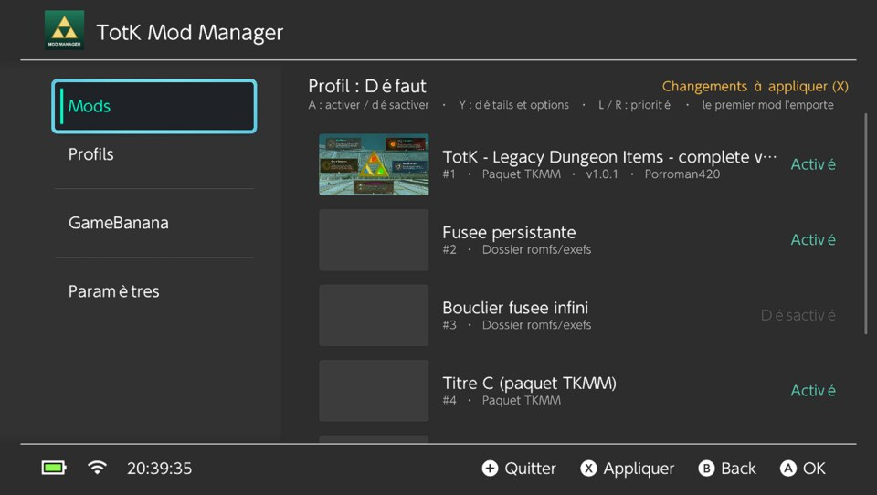
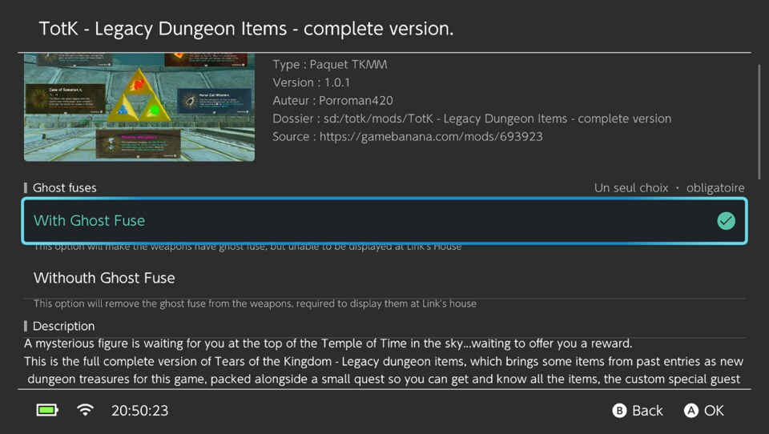
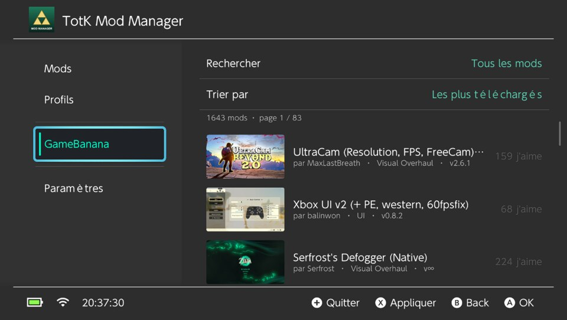
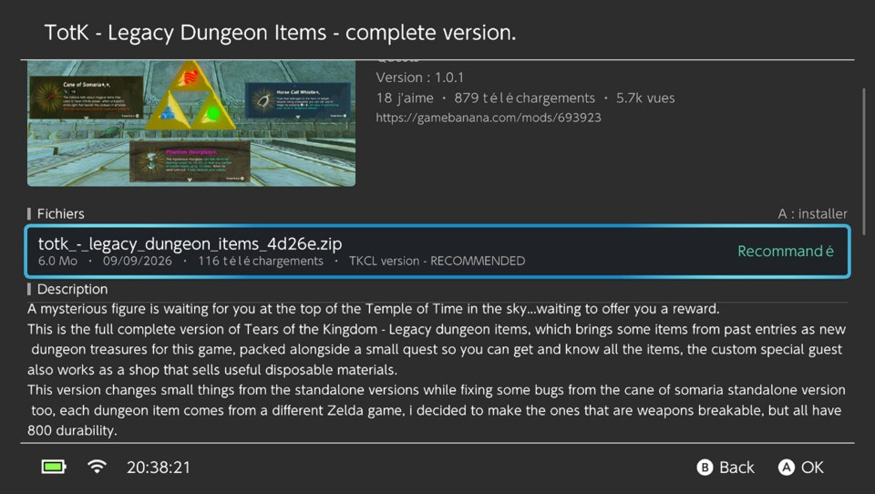
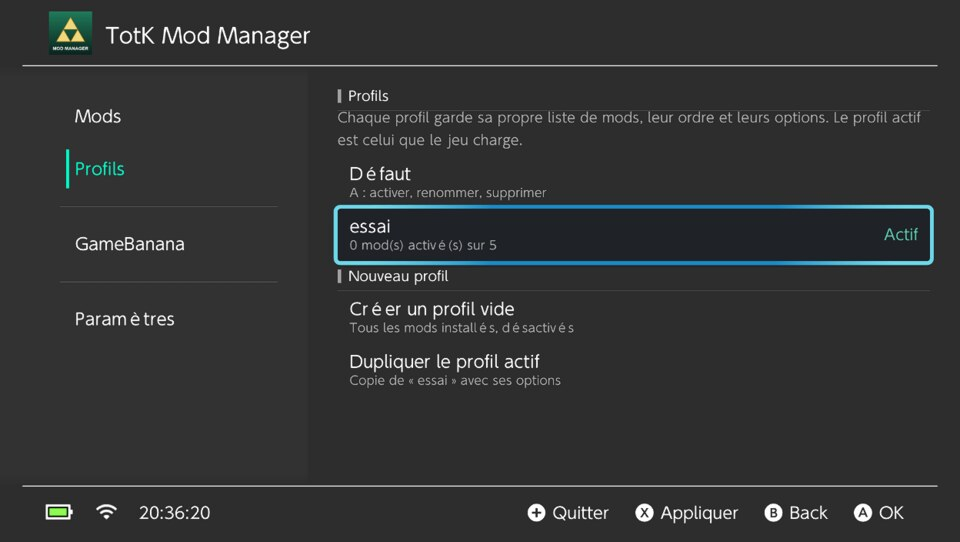
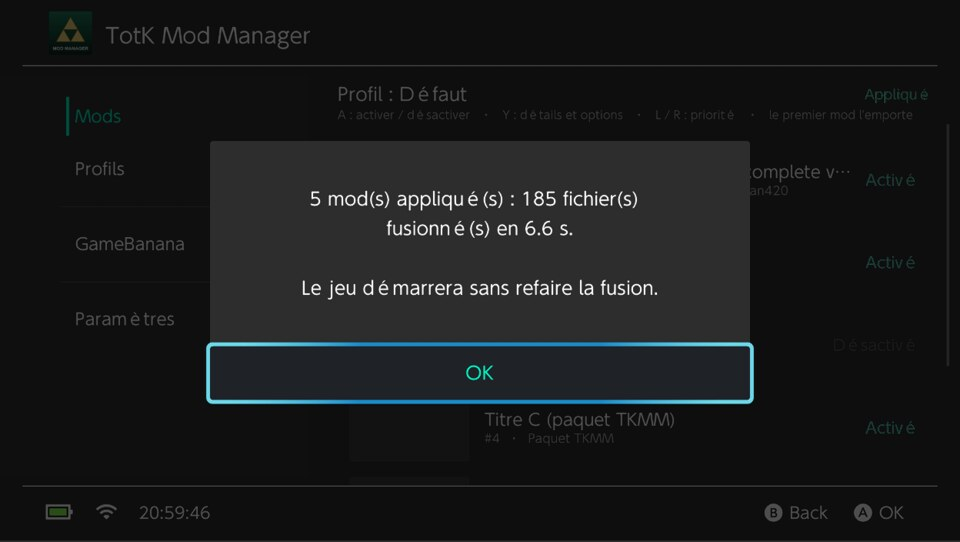
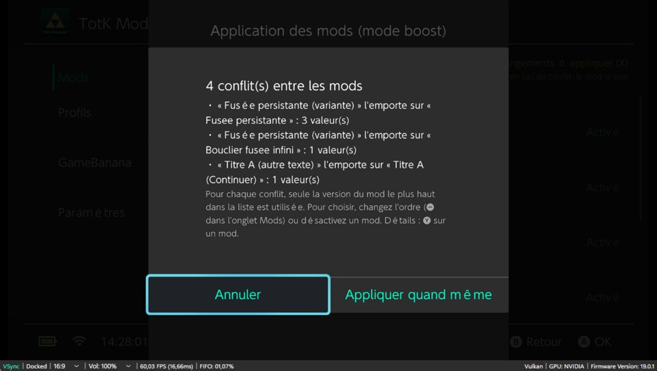
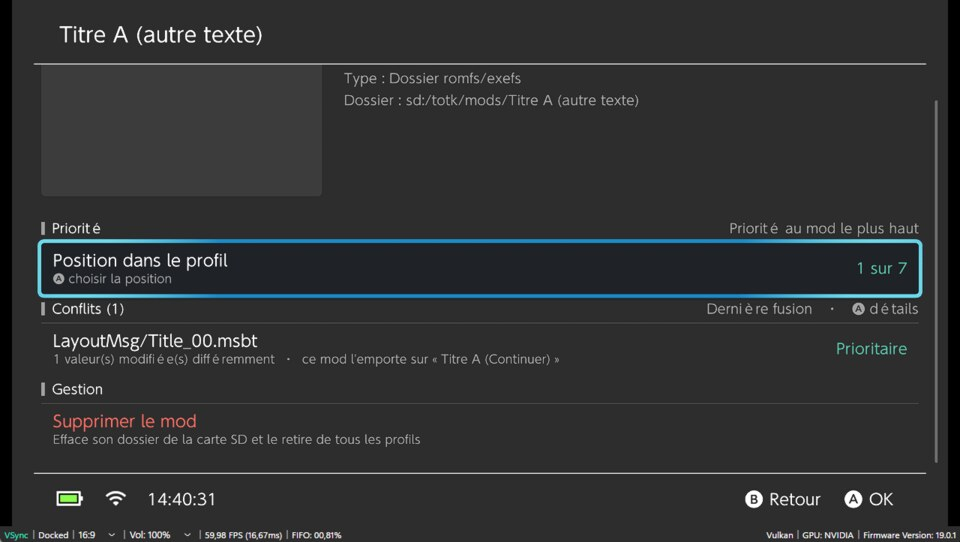
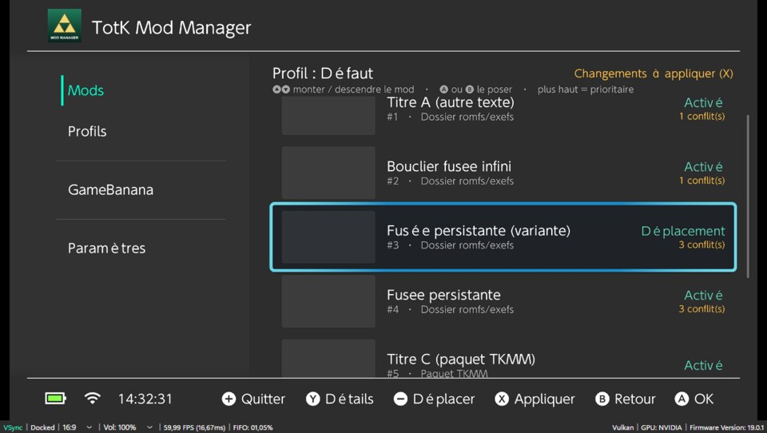
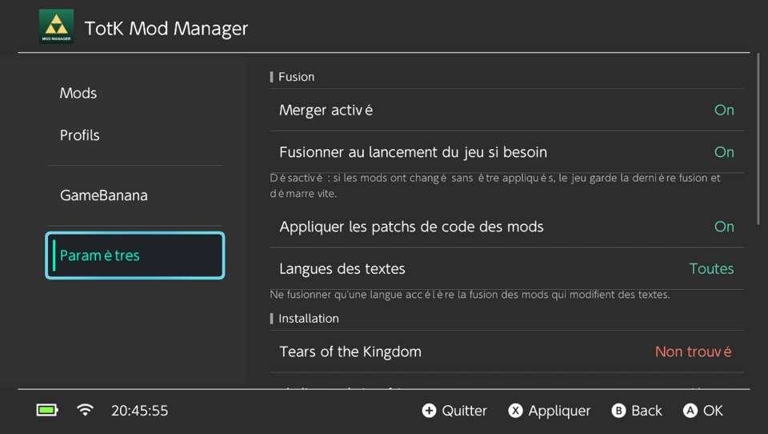

# totk-mod-manager

*[English version](README.md)*

Gestionnaire de mods **sur la console** pour Tears of the Kingdom, compagnon de
[totk-mod-merger-plugin](../totk-mod-merger-plugin) : l'équivalent homebrew de TKMM.

- activer / désactiver les mods, gérer leur **priorité** (le plus haut l'emporte), choisir les
  **options** des paquets TKMM ;
- **conflits** : les mods qui remplacent le même fichier ou modifient les mêmes valeurs sont
  signalés avant d'appliquer (on peut appliquer quand même), et listés dans la page de chaque mod ;
- **mods avec du code** : un mod peut fournir son propre plugin Skyline, chargé dans le jeu
  (voir plus bas) ; la liste l'indique, et sa page permet de le laisser de côté ;
- **profils** (listes de mods nommées) ;
- **installer depuis GameBanana** (recherche, tri, pages, vérification MD5, archives zip/7z/rar
  ou `.tkcl`) ;
- **Appliquer** : faire la fusion dans le homebrew, sans extraire le jeu sur la carte SD, en
  **mode boost** (avec sys-clk : processeur et mémoire au maximum). Le jeu démarre ensuite sans
  refusionner, et les 10 dernières fusions restent **en cache** pour revenir à l'une d'elles sans
  attendre ;
- interface en **français** et en **anglais** (langue de la console, ou au choix).

Interface [borealis](https://github.com/xfangfang/borealis) (deko3d). La fusion est le code même
du plugin, compilé pour le homebrew : résultat identique, et le plugin reconnaît la fusion faite ici
(`using the previous merge` dans son log).


|                                                  |                                                          |
| -------------------------------------------------- | ---------------------------------------------------------- |
|                            |                  |
|                |                       |
|                      |                          |
|  |  |
|            |                       |

*(captures sous Ryujinx, dont la police de remplacement espace les lettres accentuées)*

## Installation

Les packs du dépôt le contiennent déjà, à côté de skyline-totk et du fusionneur : copier
`release/pack-switch/SD/` à la racine de la carte SD, le manager est dans `switch/`. Voir
[docs/build.fr.md](../docs/build.fr.md).

À la main, ou pour ne mettre à jour que le manager :

1. skyline-totk et totk-mod-merger-plugin installés (voir leurs README).
2. Copier `totk-mod-manager.nro` dans `sd:/switch/`.

Sous émulateur, prendre `totk-mod-manager-ryujinx.nro` (`release/pack-emulator/`) : c'est le même
programme, avec les deux instructions ARMv9 que le JIT de Ryujinx refuse remplacées. La version
console y plante au lancement.

## Utilisation


| Bouton    | Action                                                                                              |
| ----------- | ----------------------------------------------------------------------------------------------------- |
| **A**     | activer / désactiver le mod, ouvrir un élément                                                   |
| **Y**     | page du mod : position, options, conflits, description, suppression                                 |
| **−**    | prendre le mod pour le déplacer :**↑ / ↓** le montent ou le descendent, **A** ou **B** le posent |
| **L / R** | monter / descendre le mod d'un cran                                                                 |
| **X**     | **Appliquer** (partout)                                                                             |
| **+**     | quitter                                                                                             |

La page d'un mod (**Y**) permet aussi de choisir directement sa position dans la liste.

Les changements (activation, ordre, options, profil) sont enregistrés immédiatement sur la carte SD.
Tant qu'ils ne sont pas appliqués, l'onglet Mods affiche « Changements à appliquer » ; s'ils ne le
sont jamais, le plugin fusionnera au démarrage du jeu comme avant (ou gardera l'ancienne fusion si
`Fusionner au lancement du jeu si besoin` est désactivé dans les paramètres).

### Appliquer sans dump du jeu : lancer le manager « par le jeu »

La fusion a besoin des fichiers d'origine du jeu. Plutôt qu'un dump de 16 Go sur la SD, le manager
lit **le romfs du jeu installé**, ce que la console n'autorise qu'au programme qui *est* le jeu :

1. sur le menu HOME, **maintenir R en lançant Tears of the Kingdom** ;
2. le menu homebrew s'ouvre à la place du jeu (« title override » d'Atmosphère) ;
3. lancer TotK Mod Manager, puis **X** pour appliquer, puis « Lancer le jeu » (relance TotK
   normalement, avec skyline-totk et les mods).

Dans ce mode, Atmosphère exécute le homebrew *sous l'identité de TotK* : le système de fichiers lui
ouvre alors les données du jeu (jeu de base + mise à jour) comme au jeu lui-même
(`romfsMountFromCurrentProcess`), et il dispose de toute la mémoire d'une application. Paramètres →
« Mode de lancement » indique « Par le jeu (R) » quand c'est le cas.

Autres sources, essayées dans l'ordre si le manager n'est pas lancé par le jeu :

- le jeu **en pause en arrière-plan** (lancé puis HOME, manager ouvert depuis l'album) : son romfs
  est lu à travers lui (`romfsMountDataStorageFromProgram`) ;
- un romfs extrait dans `sd:/totk/romfs/` (utile sous émulateur).

Sinon, « Appliquer » explique la marche à suivre, et la fusion reste faite par le plugin au
démarrage du jeu.

### Mode boost

La fusion dépend beaucoup du processeur et surtout de la mémoire (sur une console, 3 mods et
~4 700 fichiers : 1 min 15 s normalement, 59 s en mode boost, 42 s avec en plus la mémoire à
1600 MHz). Paramètres → *Mode boost*, pendant la fusion seulement :


| Mode                  | Effet                                                                                                                                                                                                                                    |
| ----------------------- | ------------------------------------------------------------------------------------------------------------------------------------------------------------------------------------------------------------------------------------------ |
| Désactivé           | rien                                                                                                                                                                                                                                     |
| Standard              | le mode boost du système, celui des chargements de jeux : processeur à 1785 MHz au lieu de 1020, GPU ralenti                                                                                                                           |
| **Maximum** (défaut) | Standard, plus, si[sys-clk](https://github.com/retronx-team/sys-clk) tourne, ses surcharges temporaires (celles de son overlay) : processeur et mémoire aux fréquences choisies, 1785 et 1600 MHz par défaut (les maximums d'origine) |

Avec sys-clk, les fréquences proposées sont celles qu'il déclare pouvoir régler : des valeurs plus
hautes n'apparaissent qu'avec une version d'overclock. Les surcharges qui existaient avant la fusion
(réglées dans l'overlay) sont remises à la fin, et à la sortie du manager. Si le manager est fermé
de force pendant une fusion (HOME → Fermer le logiciel), les surcharges restent jusqu'à les changer
dans l'overlay. Le manager ne cherche sys-clk que s'il est installé
(`atmosphere/contents/00FF0000636C6BFF`). Quand l'onglet Mods indique « Appliqué », le boost n'est pas lancé.

### Mods avec du code

Un mod peut contenir un `plugin.nro` (ou plusieurs dans un dossier `plugins/`) à côté de son
`romfs`, voire n'être que cela. Le plugin du jeu les charge une fois la fusion servie, dans l'ordre
des mods : c'est ce qui permet à plusieurs mods de code de coexister, là où une console n'a qu'un
seul `exefs`, déjà occupé par Skyline.

- L'onglet Mods affiche « plugin » sur ces mods, et « Code (plugin) » pour ceux qui n'ont aucun
  fichier à fusionner.
- La page du mod (**Y**) liste les `.nro` fournis et permet de ne pas charger ce code
  (`plugins = 0` dans son `mod.ini`) tout en gardant ses fichiers.
- Paramètres → *Charger le code fourni par les mods* désactive le chargement pour tous les mods
  (`mod_plugins` dans `config.ini`) — à utiliser si un mod fait planter le jeu.

Ces réglages ne changent pas la fusion : ils sont lus par le plugin au démarrage du jeu, il n'y a
donc rien à appliquer. Écrire un tel plugin : voir le README du merger (section *Mods avec du
code*) et son exemple `plugins/enemy-hp`.

### Conflits entre mods

Après avoir lu les mods et avant de fusionner, le moteur compare ce qu'ils changent :

- **fichier remplacé** : plusieurs mods fournissent un fichier qui ne se fusionne pas (modèle,
  texture, IA…) et dont le contenu diffère. Seule la version du mod le plus haut est utilisée ;
- **valeurs** : plusieurs mods modifient la même valeur d'un fichier fusionné (paramètre d'un
  `.bgyml`, ligne de RSDB ou de GameData, texte d'un `.msbt`…) avec des valeurs différentes. La
  valeur du mod le plus haut est utilisée. Les ajouts (nouvelles lignes, nouveaux éléments de
  liste) et les modifications de valeurs différentes se fusionnent sans conflit.

S'il y en a, « Appliquer » les résume (quel mod l'emporte sur quel autre, combien de fichiers et de
valeurs) et demande **Annuler** ou **Appliquer quand même**. Annuler ne touche pas à la fusion
existante. L'avertissement se désactive dans les paramètres.

La liste reste consultable : l'onglet Mods indique le nombre de conflits de chaque mod, et sa page
(**Y**) les détaille, avec pour chacun « Prioritaire » ou « Écrasé » selon l'ordre actuel du profil,
et **A** pour le chemin complet, l'ordre des mods concernés et les valeurs en jeu. Changer l'ordre met
ces indications à jour immédiatement ; la liste elle-même est celle de la dernière analyse (à chaque
fusion, par le manager ou par le plugin au démarrage du jeu, qui les écrit aussi dans `merger.log`).
Les textes sont comparés dans la langue du jeu.

### GameBanana

Même API que TKMM (apiv12, jeu 7617), 20 mods par page, contenu classé écarté. La liste se trie
par **nombre de téléchargements**, mentions « j'aime », vues, nouveautés ou mises à jour récentes,
et la recherche démarre à trois caractères. La page d'un mod montre ses captures, ses chiffres et
ses fichiers ; le fichier recommandé est signalé comme tel, et ceux que GameBanana a archivés
viennent ensuite, marqués **Archivé**.

Installer un fichier : téléchargement dans `sd:/totk/downloads/`, contrôle MD5, extraction (libarchive), puis
recherche comme TKMM : un `.tkcl` prioritaire, sinon les dossiers contenant `romfs/`/`exefs/` (ou un
romfs nu). S'il y en a plusieurs (variantes), le manager demande lequel installer. Le mod arrive dans
`sd:/totk/mods/<nom>/` avec un `mod.ini` (nom, version, auteur, description, lien) et sa vignette,
et se place **en tête du profil actif**. Réinstaller le même mod le met à jour en gardant ses
réglages. Les `plugin.nro` du mod sont installés avec lui. Un avertissement signale le code exefs
(`subsdk`, `main.npdm`…), que le merger ignore : ce code doit être fourni en plugin pour être
chargé.

### Réglages

L'onglet, dans l'ordre :

| Groupe | Ce qu'on y trouve |
|---|---|
| **Fusion** | *Fusionneur activé* · *Fusionner au lancement du jeu si besoin* · *Appliquer les patchs de code des mods* (`.ips`/`.pchtxt`) · *Charger le code fourni par les mods* · *Avertir des conflits avant d'appliquer* · *Langues des textes* · *Fusions gardées en cache* (de 1 à 50) et la place que ce cache occupe sur la carte SD |
| **Interface** | *Langue / Language* : celle de la console, ou imposée. Elle prend effet au prochain lancement, que le manager propose de faire tout de suite |
| **Installation** | ce qui est en place : le jeu et sa version, l'`exefs` de skyline-totk, le plugin fusionneur — chacun *Installé* ou *Absent*. Un avertissement apparaît si un dossier `atmosphere/contents/0100F2C0115B6000/romfs` existe, parce qu'il ralentit chaque démarrage. Puis *Lancé comme* : par le jeu (R), en application, ou en applet (album) |
| **Maintenance** | *Vider le cache de fusion* : les fusions gardées (`sd:/totk/merged`), les changelogs (`cache`) et les téléchargements. Les mods et les profils restent |
| **À propos** | la version, et où se trouve le journal |
| **Mode boost** | *Pendant la fusion* (désactivé, standard, maximum) et, avec sys-clk, les fréquences processeur et mémoire |

*Langues des textes* mérite un mot : sur *Auto*, seule la langue que lit le jeu est fusionnée — le
plugin la note au lancement — ce qui réduit d'autant le temps de fusion des mods qui touchent aux
textes. *Toutes* les fusionne toutes.

Ces réglages s'écrivent à deux endroits : ceux que le plugin lit aussi vont dans
`sd:/totk/config.ini` (fusionneur activé, fusion au démarrage, patchs de code, plugins des mods,
langues des textes, taille du cache), ceux qui appartiennent au manager dans
`sd:/totk/manager.ini` (le boost et ses fréquences, l'avertissement de conflits, la langue).

### Fichiers sur la carte SD

```
sd:/switch/totk-mod-manager.nro
sd:/totk/
├── config.ini          profil actif et réglages (partagés avec le plugin)
├── mods/<mod>/         un dossier par mod : romfs/, exefs/ ou .tkcl, mod.ini, thumbnail.jpg
│                      (et son plugin.nro, s'il en fournit un)
├── profiles/<nom>.ini  un fichier par profil
├── merged/             fusions gardées, communes au plugin et au manager
├── cache/              changelogs des mods dossier, conflicts.tsv (conflits de la fusion servie)
├── locale.txt          langue du jeu, notée par le plugin
├── downloads/          téléchargements en cours (vidé après installation)
├── manager.ini         préférences du manager (boost, fréquences sys-clk, avertissement, langue)
└── manager.log         journal du manager
```

**Cache de fusion.** Les 10 dernières fusions restent sur la carte SD (Paramètres → *Fusions gardées
en cache*, de 1 à 50) : changer de profil ou réactiver un mod ressert une fusion gardée
immédiatement (« Fusion retrouvée dans le cache »), et une nouvelle fusion n'écrit que les fichiers
qu'aucune autre n'a déjà produits. Paramètres → *Cache de fusion* affiche le nombre de fusions et la
place occupée. Détails dans le README du plugin.

La langue de l'interface suit celle de la console (français pour le français et le français
canadien, anglais sinon) ; Paramètres → « Langue / Language » la force, au prochain lancement.

Au premier lancement, le manager crée le profil « Défaut » à partir des mods présents (ordre de leurs
`priority`), range dans un dossier les `.tkcl` posés en vrac dans `mods/` (ancienne disposition), et
ajoute en tête du profil actif les mods copiés à la main depuis.

## Compilation

Depuis la racine du dépôt, tout est dans le conteneur (voir
[docs/build.fr.md](../docs/build.fr.md)) :

```bash
./build.sh totk-mod-manager    # les deux .nro, dans output/manager/nro/
```

Seul, dans un shell qui a devkitPro, cmake et la nightly (`./build.sh shell`) :

```bash
./build.sh                                   # totk-mod-manager.nro, dans build/
./build.sh --ryujinx --build-dir /work/output/manager --out /tmp/nro
```

Prérequis, si jamais c'est construit hors du conteneur : devkitPro avec `switch-dev`, `cmake`,
`switch-glm`, `switch-curl`, `switch-libarchive`, la nightly `nightly-2024-10-09` avec
`rust-src`, et le sous-module borealis dans `library/borealis`.

`build.sh` compile d'abord le cœur Rust (`core/`) pour `aarch64-unknown-none` (`-Zbuild-std`),
puis l'application avec CMake/devkitA64. La variante Ryujinx remplace une lecture du registre ARMv9
`GCSPR_EL0` que contient le dérouleur d'exceptions de libgcc (devkitA64 16) et que le JIT de Ryujinx
refuse ; la vraie console n'exécute jamais ce chemin.

## Architecture

```
core/                     cœur Rust : bibliothèque statique no_std, API C (include/totk_manager_core.h)
  src/lib.rs              état (JSON), profils, installation, fusion (engine de totk-merge)
  src/install.rs          analyse des archives décompressées, installation, migration
  src/json.rs             le JSON transmis à l'interface, écrit sans bibliothèque
  src/nx.rs               allocateur (malloc de newlib) et panics
source/
  core/host.cpp           fonctions tkm_host_* : accès fichiers du cœur (newlib, fs libnx)
  core/core.cpp           côté C++ du cœur (structures)
  core/game.cpp           romfs du jeu (title override, jeu en pause, dump), version, lancement
  net/                    libcurl (TLS du système), API GameBanana
  util/                   archives (libarchive), MD5, images en arrière-plan, threads, journal
  app/                    écrans borealis
resources/                traductions (fr, en-US), icône
library/borealis/         borealis (xfangfang)
```

Le cœur est `totk-merge` construit **sans `std`** : ses accès aux fichiers passent par les
`tkm_host_*` de `source/core/host.cpp`, et les chemins `sd:/` du plugin sont résolus en `sdmc:/`.
Profils, `mod.ini`, `.tkcl` et fusion n'ont ainsi qu'une implémentation pour le plugin et le
homebrew.

### Bibliothèques


|                        |                                                                      |
| ------------------------ | ---------------------------------------------------------------------- |
| borealis (xfangfang)   | interface, avec son nlohmann::json                                   |
| CMake                  | exigé par borealis ;`build.sh` l'appelle                            |
| libcurl (devkitPro)    | construit sur le service TLS de la console : certificats du système |
| libarchive (devkitPro) | zip, 7z, rar                                                         |

## Tests

Sous Ryujinx 1.3.3 (clavier en guise de manette) : migration de l'ancienne disposition et création
du profil, activation, réordonnancement, options (choix unique/multiple), création / activation /
suppression de profils, recherche GameBanana et installation d'un vrai mod (zip contenant un
`.tkcl` avec options), réglages, **Appliquer** depuis `sd:/totk/romfs`, puis démarrage du jeu :
`using the previous merge (79 files)` et mods présents à l'écran titre.

Puis, avec deux variantes générées pour se contredire (une valeur de la fusée, un texte de l'écran
titre) : fenêtre de conflits (4 conflits), **Annuler** puis **Appliquer quand même**, mode boost
activé et retiré, nombre de conflits dans l'onglet Mods, page d'un mod (Prioritaire / Écrasé, détail
d'un conflit), déplacement avec **−** et **↑ / ↓**, choix de la position depuis la page du mod,
réglages, passage en anglais puis retour en automatique, sortie avec **+**.

Côté moteur, `cargo test -p totk-merge` couvre la détection (valeurs, ajouts, nœuds remplacés, mods
d'accord avec le gagnant, format du fichier) et le test d'intégration `engine` la vérifie sur de
vrais fichiers du jeu (paramètre d'un `.bgyml`, fichier entier, texte d'un `.msbt`, annulation).

Cache de fusion : tests unitaires (éviction, fichiers partagés, fusion interrompue, fichier tronqué)
et d'intégration (deux jeux de mods en alternance, retour depuis le cache, taille 1). Sous Ryujinx,
démarrage du jeu avec l'ancienne disposition de `merged/` (supprimée, fusion refaite dans le cache,
fichiers servis depuis `store/`), puis dans le manager : Paramètres (mode boost sans sys-clk, taille
et occupation du cache), un mod désactivé puis appliqué (2 fichiers écrits, 1 déjà présent), réactivé
puis appliqué (« Fusion retrouvée dans le cache »).

Mods avec du code : sous Ryujinx, un mod qui n'est que `mod.ini` + `plugin.nro` est listé
« Code (plugin) », chargé au démarrage du jeu après la fusion, retrouve son dossier et lit les
fichiers **fusionnés** (avec un mod qui met le Bokoblin bleu à 1 PV par-dessus, son rapport indique
1 au lieu de 72). Côté moteur, `cargo test` couvre la découverte des `.nro` (dossier du mod,
`plugins/`, mod rangé un cran plus bas, `plugins = 0`) et leur installation depuis une archive.

Non testé (impossible sous émulateur) : sys-clk, le lancement par le jeu (title override) et la
lecture du romfs de la console, le lancement du jeu depuis le manager, et la mémoire en mode applet.
Vérifiés sur console par l'utilisateur : la sortie vers le menu homebrew et le relancement après un
changement de langue.

## Crédits

Ce que ce homebrew doit à d'autres — la liste complète du dépôt est dans
[CREDITS.fr.md](../CREDITS.fr.md) :

- [borealis](https://github.com/xfangfang/borealis) (xfangfang, d'après natinusala), Apache-2.0 —
  toute l'interface, deko3d sur Switch, en sous-module dans `library/borealis`. Il embarque
  nlohmann::json, dont se sert `net/gamebanana.cpp`, le décodage d'images par lequel passent les
  vignettes (nanovg/stb_image), et les polices *Material Icons* (Apache-2.0, Google).
- [TKMM / TkSharp](https://github.com/TKMM-Team/Tkmm) (TKMM-Team), MIT — la fusion, le format de
  paquet `.tkcl` et les réglages que cette interface expose. Le cœur Rust est un portage de
  `TkSharp.Merging`, partagé avec le plugin fusionneur.
- [sys-clk](https://github.com/retronx-team/sys-clk) (RetroNX), GPL-3.0 — le service IPC auquel le
  mode boost demande de monter les fréquences processeur et mémoire pendant une fusion. Son
  protocole est ré-implémenté dans `source/core/sysclk.cpp` : aucun code de sys-clk n'est repris.
- [devkitPro](https://devkitpro.org/) — devkitA64, libnx et les portlibs auxquelles le homebrew se
  lie : libcurl (sur le service TLS de la console), libarchive, zlib, bzip2, xz, lz4, zstd, expat.
- [SimpleModDownloader](https://github.com/PoloNX/SimpleModDownloader) (PoloNX), GPL-3.0 — le
  homebrew qui parcourt et installe les mods de GameBanana depuis la console, sur borealis lui
  aussi : la référence derrière l'onglet GameBanana de ce manager (recherche, tri, pages, fichiers
  d'un mod, contrôle MD5, extraction de l'archive).
- [GameBanana](https://gamebanana.com/) — le catalogue de mods que l'onglet parcourt via son API
  publique (apiv12), et les auteurs des mods qu'on y installe.
- [Atmosphère](https://github.com/Atmosphere-NX/Atmosphere) — le *title override* (maintenir R)
  qui permet au manager de lire les fichiers du jeu sans dump, et
  [hbmenu](https://github.com/switchbrew/nx-hbmenu), qui le lance.
